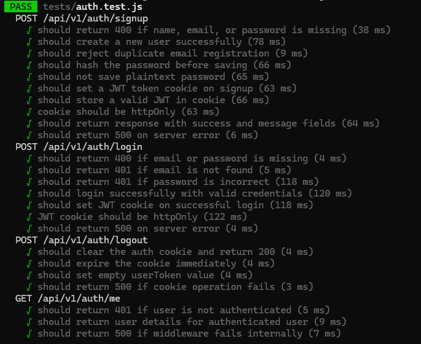
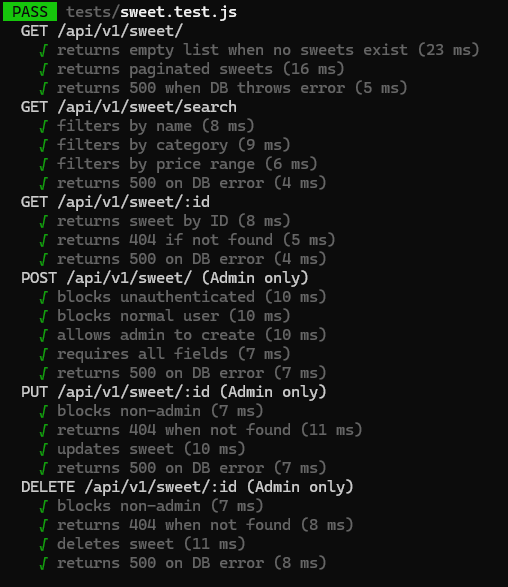
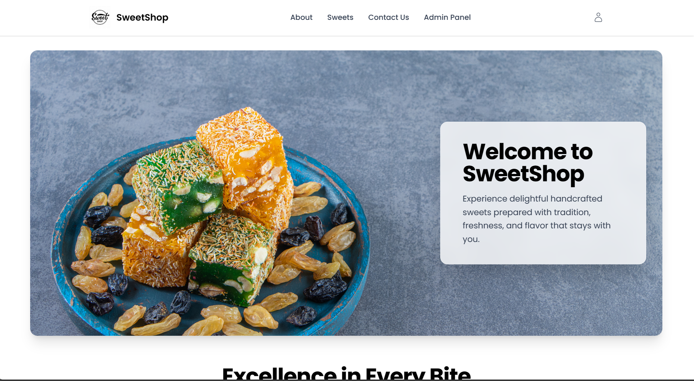
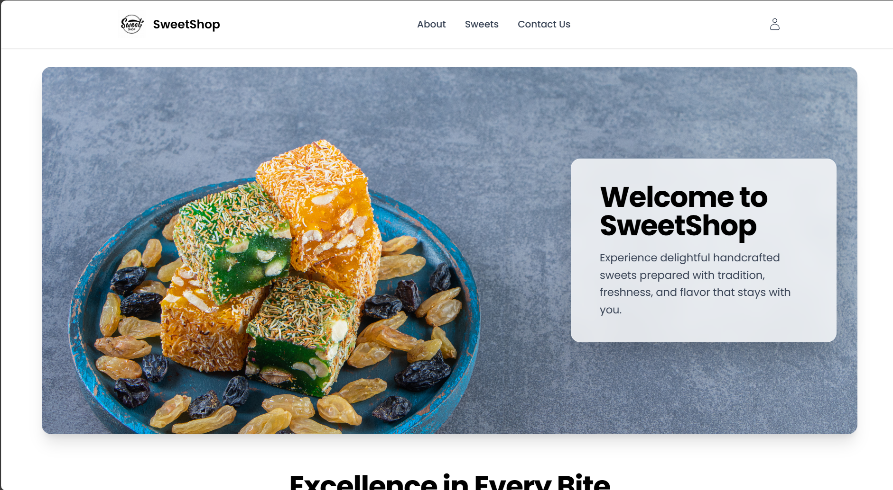

# Sweet Shop Management System

A MERN-stack single-page application designed to manage and maintain sweet shop inventory efficiently. It allows users to browse and purchase sweets, while admins can fully manage stock operations including adding, updating, deleting, and restocking sweets. The UI is smooth and responsive, featuring real-time stock updates and cookie-based authentication. The admin dashboard becomes visible only when an admin is logged in.

## Live Link

**URL:** <https://sweetshopar.vercel.app>

## Technology Used

- MongoDB
- Express.js
- React.js
- Node.js
- Context API for global state management
- JWT Authentication
- Cookies for storing authentication tokens
- Vercel (deployment)
- Jest / React Testing Library (testing)

## Test Result File

##### Client


##### Server


'


## Features

### User Features

- Explore sweets without logging in.
- Login required only when purchasing.
- View full details of any sweet.

### Admin Features

- Two roles: user and admin.
- Admin accounts must be created manually in the database.
- Admin can:
  - Add sweets
  - Update sweets
  - Delete sweets
  - Restock sweets
- Admin dashboard appears in the navbar only for admins.

### Application Features

- MERN-stack Single Page Application.
- Context API for consistent global state management.
- Backend and frontend logic fully tested.
- Pagination for fast sweet browsing.
- Cookie-based JWT authentication for secure sessions.

### Application Screenshots

#### Admin Login Screenshots




#### Login page


#### User Login Screenshots




## API Endpoints

### User APIs

- **POST** `/user/signup` – Register user  
- **POST** `/user/login` – Login user/admin  
- **GET** `/user/me` – Verify authentication and authorization  (Protected)

### Sweet APIs (Public)

- **GET** `/sweet/` – Fetch all sweets (pagination)  
- **GET** `/sweet/search/` – Search sweets  
- **GET** `/sweet/:id` – Sweet details  

### Admin Sweet Management APIs (Protected)

- **POST** `/sweet/` – Add sweet  
- **PUT** `/sweet/` – Update sweet  
- **DELETE** `/sweet/` – Delete sweet  

### Inventory APIs (Protected)

- **POST** `/inventory/:id/purchase` – Purchase sweet & update stock  
- **POST** `/inventory/:id/restocking` – Restock sweet  

## Admin Credentials

- **Email:** <admin@gmail.com>  
- **Password:** admin@123  
Users may create their own accounts for testing.

## Running the Project Locally

### Client Setup

- Run:

  ```bash
  npm i

- Create a `.env` file in the client directory and add the following content:

  ```bash
  VITE_BASE_URL=http://localhost:5173

- Then open terminal and run:

  ```bash
  npm run dev

### Server Setup

- Run:

  ```bash
  npm i

- Create a `.env` file in the client directory and add the following content:

  ```bash
  PORT=5000
  MONGO_URI=mongodb://127.0.0.1:27017/sweetshop
  NODE_ENV=development 
  JWT_SECRET=<your_secret_key> 
  FRONTEND_URL=http://localhost:5173

- Ensure mongo db server is install on your local machine

- Then open terminal and run:

  ```bash
  npm run dev

## My AI Usage

### AI Tools Used

- ChatGPT (only AI tool used)

### How I Used AI

#### Backend Development

- Used AI to generate structured templates for backend test cases, including authentication, sweet management, and inventory operations.
- Leveraged AI to validate API design flow and ensure consistent request/response patterns.
- Utilized AI for alternative logic suggestions during debugging, helping uncover edge cases without modifying core logic.

#### Frontend Development

- Generated initial logical test case formats to maintain consistent UI component validation.
- Used AI for UI/UX refinement, including enhancements in spacing, layout hierarchy, and responsiveness.
- Received suggestions for improving state management flow and responsive design techniques.
- All functional logic, component behavior, hooks, and state-flow implementations were written manually; AI was used only for refinement.

#### Documentation

- AI assisted in restructuring and formatting documentation to improve clarity and readability.
- Helped summarize complex explanations for developer-friendly documentation.
- Improved grammar, tone, formatting, and overall presentation while keeping the content technically accurate.

---

### Reflection on AI Impact

- **Faster Test Case Creation**  
  AI reduced time spent drafting test structures, allowing more focus on implementation and debugging.

- **Improved UI Consistency**  
  Visual suggestions helped refine layout, spacing, and responsiveness, contributing to a polished frontend design.

- **Better Debugging Through External Perspectives**  
  AI offered alternative approaches that helped identify bugs and logic gaps more efficiently.

- **Enhanced Documentation Quality**  
  The README and internal documentation became clearer, more professional, and easier to maintain.

- **Full Control Over Core Logic**  
  All core backend logic, frontend logic, and architectural decisions were manually written for accuracy and reliability.  
  AI served purely as a supportive tool for formatting, refining, and guiding—not for generating core implementation code.
